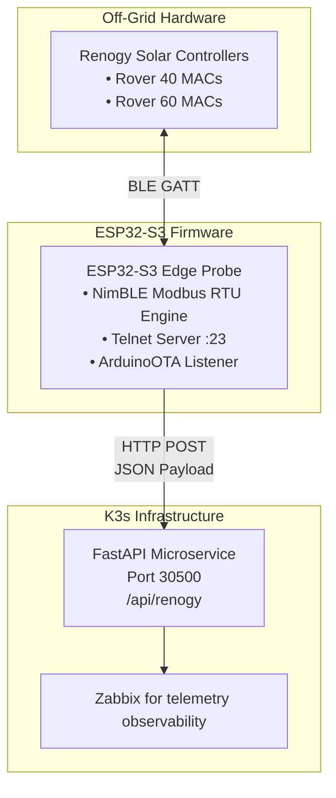

# 🌞 Modbus Solar Power Telemetry System 🌞


This repo contains Arduino C++ code and a Python RESTful API microservice endpoint for use with a Renogy Bluetooth stack. It uses an inexpensive ESP32-S3 development board to read modbus telemetry data and send it to a Kubernetes (k8s) microservice. The project deploys using GitHub Container Registry (GHCR).


## Quick Start

1. **Set Up the ESP32 Firmware**
   - Edit the [esp32-ble-probe.cpp](./src/esp32-ble-probe.cpp).
   - Upload it to your ESP32 device.

2. **Hardware Requirements**
   - Use the following device:
     - [ESP32-S3 DevKitC-1 N16R8 Development Board](https://www.amazon.com/dp/B0GVSHT2Q2)
   - Alternatively, use these specifications if the above is unavailable:
     - Dual-Core Xtensa LX7
     - 16MB Flash + 8MB PSRAM
     - WiFi & Bluetooth 5.0
     - USB-C
     - External Antenna Support for IoT & Embedded Projects

## Dependencies

Before proceeding, ensure you have the following tools installed:
- Arduino IDE (for ESP32 development)
- Python (for the microservice)
- Docker (for containerization)
- kubectl (for Kubernetes operations)

## Build and Deploy the Microservice

1. **Authenticate and Push Container Image to GitHub Container Registry (GHCR)**
   ```bash
   echo "<GHCR_TOKEN>" | docker login ghcr.io -u vinas1 --password-stdin
   docker build -t ghcr.io/vinas1/solar-service:v1 .
   docker push ghcr.io/vinas1/solar-service:v1
   ```

2. **Configure K3s to Use the GitHub Container Registry (GHCR) Secret**
   ```bash
   kubectl create secret docker-registry ghcr-secret \
     --docker-server=ghcr.io \
     --docker-username=vinas1 \
     --docker-password=<GHCR_TOKEN> \
     --docker-email=vinas1@nospam.com \
     --namespace=default

3. **Deploy the Kubernetes Manifest to Your K3s Cluster**
   ```bash
   kubectl apply -f solar-service.yaml
   ```

4. **Verify Pod Health and Test API Endpoint**
   ```bash
   kubectl get pods -l app=solar-service
   curl -X POST http://localhost:30500/api/renogy \
     -H "Content-Type: application/json" \
     -d '{"controller1": {"battery_voltage": 13.6}}'

5. **Inspect Logs and Manage Iterative Updates**
   ```bash
   # Monitor live container output
   kubectl logs -l app=solar-service --tail=20 -f

   # Force restart pods after pushing code updates
   kubectl rollout restart deployment solar-service

   # Reload Zabbix cache for updated trapper items
   zabbix_server -R config_cache_reload
   ```

## Detailed System Architecture

This document outlines the system architecture for the edge probe firmware and telemetry pipeline monitoring dual Renogy Rover Charge Controllers via Bluetooth Low Energy (BLE) Modbus RTU.



Telemetry data is sent to Zabbix for observability.
## Component Specifications

### Edge Firmware Subsystems (ESP32-S3)
- **Macro Objective:** Automated, off-grid solar power system telemetry monitoring.
- **Toolchain & Build Environment:**
  - Platform/Framework: `espressif32`, Arduino framework targeted for ESP32-S3 (e.g., `esp32-s3-devkitc-1`).
  - Required Libraries:
    - `h2zero/NimBLE-Arduino` (v2.5.0 or higher)
    - `bblanchon/ArduinoJson` (if refactoring string construction)
- **Flash & Partition Table Requirements:** Must use a partition scheme with enlarged app partitions (such as `min_spiffs.csv` or `huge_app.csv`) to accommodate both the NimBLE stack and `ArduinoOTA` flash memory overhead.
  
- **Hardware & Connectivity:**
  - Wi-Fi SSID: `${WIFI_SSID}`
  - WPA2 Key: `${WIFI_PASSWORD}`
  - OTA Hostname: `esp32-ble-probe`
  - OTA Password: `yourpass`
  - OTA Port: `3232`

- **Operational Behavior:**
  - Non-blocking 15-second polling loop.
  - Background reconnection every 5 seconds if Wi-Fi connection drops.

- **BLE/Modbus Details:**
  - BLE TX/RX pipes:
    - Service `0000ffd0-0000-1000-8000-00805f9b34fb` | Characteristic `0000ffd1-0000-1000-8000-00805f9b34fb`
    - Service `0000fff0-0000-1000-8000-00805f9b34fb` | Characteristic `0000fff1-0000-1000-8000-00805f9b34fb`
  - Modbus RTU frame construction:
    - Function Code: 0x03
    - Start Register Address: 0x0100
    - Register Count: 34 registers (68 bytes)
    - CRC Checksum: Polynomial `0xA001`, initial value `0xFFFF`

- **Binary Telemetry Parsing Map:**
  | Metric | Buffer Byte Offset | Data Type | Register Scale Factor | Target Output Unit |
  | --- | --- | --- | --- | --- |
  | Battery SOC | `rxBuffer[3..4]` | `uint16_t` (Big-Endian) | $1:1$ | % |
  | Battery Volts | `rxBuffer[5..6]` | `uint16_t` (Big-Endian) | $0.1$ | Volts (V)
  | Charging Amps | `rxBuffer[7..8]` | `uint16_t` (Big-Endian) | $0.01$ | Amperes (A)
  | PV Input Volts | `rxBuffer[17..18]` | `uint16_t` (Big-Endian) | $0.1$ | Volts (V)
  | PV Input Amps | `rxBuffer[19..20]` | `uint16_t` (Big-Endian) | $0.01$ | Amperes (A)

### Ingestion Service (K3s Cluster)
- **Endpoint:** [http://192.168.0.60:30500/api/renogy](http://192.168.0.60:30500/api/renogy)
- **Device Mapping Logic:** Maps detected controller MAC addresses to normalized payload namespaces (rover_40 or rover_60).
- **JSON Payload Format:**
  ```json
  {
    "rover_60": {
      "battery_soc": 98,
      "battery_volts": 13.6,
      "charging_amps": 12.45,
       , pv_volts": 41.2,
      "pv_amps": 4.10
    }
  }
  ```

## Network and Service Matrix

| Service / Protocol | Source Node | Destination Node | Port / Channel | Purpose |
| :--- | --- | --- | --- | --- |
| BLE (GATT) | ESP32-S3 Probe | Renogy Controllers | 2.4 GHz Radio | Modbus RTU telemetry request/response |
| HTTP POST | ESP32-S3 Probe | K3s FastAPI | TCP 30500 | Ingestion payload transmission |
| Telnet | Workstation | ESP32-S3 Probe | TCP 23 | Remote console stream & monitoring |
| ArduinoOTA | Workstation | ESP32-S3 Probe | UDP/TCP Dynamic | Over-the-air firmware updates |

## Safeguards & Resilience

- **Buffer Safety:** Uses a dedicated 128-byte static rxBuffer with bounds checking, overflow flags, and rigid 73-byte Modbus length verification to eliminate heap fragmentation and stack corruption.
- **Connection Timeout Hierarchy:** Enforces a 5,000 ms BLE connect timeout and a 3,000 ms notification collection timeout to prevent orphaned connections from locking the main execution loop.
- **Client Cleanup:** Disconnects and deletes NimBLEClient instances on every iteration to keep internal memory allocation clean over long-term operation.

<br>  
Telemetry data is sent to Zabbix for observability. ... *see the [issues](https://github.com/vinas1/solar-microservice/issues) to report a bug and to see the feature backlog* ...
