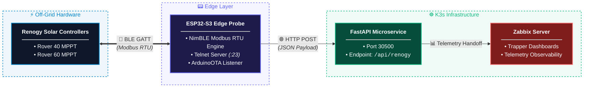

# 🌞 Renogy Rover Modbus Solar Power Telemetry System 🌞


Monitor Renogy Rover charge controllers over Bluetooth using an ESP32-S3. Then send that data to Zabbix using a micro service running in your k3s environment.

This repo contains an end-to-end telemetry pipeline for Renogy Rover solar equipment over Bluetooth. An ESP32-S3 microcontroller reads Modbus data via the Renogy Bluetooth stack and pushes it to a Python RESTful API microservice running on a Kubernetes (k3s) cluster. The microservice processes the modbus payload where our custom provided Zabbix dashboards ingest the data for real-time visualization and historical graphing. Backend container images are packaged and deployed using GitHub Container Registry (GHCR).


## How It Works

This document outlines the system architecture for the edge probe firmware and telemetry pipeline monitoring dual Renogy Rover Charge Controllers via Bluetooth Low Energy (BLE) Modbus RTU.


The system includes:

- An ESP32-S3 BLE telemetry probe
- A Python REST API
- A Docker container
- A Kubernetes deployment
- A Zabbix dashboard
- Telnet diagnostics
- Arduino OTA updates

## Supported Hardware

Tested with:

- Renogy Rover 40
- Renogy Rover 60
- Renogy BT-1 and BT-2 adapters
- [ESP32-S3 DevKitC-1 N16R8](https://www.amazon.com/dp/B0GVSHT2Q2)

Other Renogy controllers may work if the controllers use the same BLE services and Modbus register layout.

Recommended ESP32 specifications:

- ESP32-S3 dual-core processor
- 16 MB flash
- 8 MB PSRAM
- Wi-Fi
- Bluetooth Low Energy
- USB-C
- Optional external antenna

## Requirements

Install the following before starting:

- Git
- Arduino IDE or PlatformIO
- ESP32 Arduino core
- NimBLE-Arduino 2.x
- Python
- Docker
- `kubectl`
- A Kubernetes or k3s cluster
- Zabbix, Prometheus, Grafana, or another monitoring system

## Quick Start

### 1. Clone the Repository

```bash
git clone https://github.com/vinas1/solar-microservice.git
cd solar-microservice
```

### 2. Configure the ESP32

Open:

```text
src/esp32-ble-probe.cpp
```

Update the network and API settings:

```cpp
static constexpr const char* WIFI_SSID = "your-wifi";
static constexpr const char* WIFI_PASS = "your-password";
static constexpr const char* OTA_PASSWORD = "your-ota-password";

static constexpr const char* SOLAR_SERVICE_URL =
    "http://YOUR-SERVICE-IP:30500/api/renogy";
```

Update the controller MAC addresses if the included values do not match the controllers:

```cpp
static constexpr const char* ROVER_40_MAC_A = "7c:72:e7:2e:9a:f5";
static constexpr const char* ROVER_40_MAC_B = "80:6f:e7:2e:9a:f5";

static constexpr const char* ROVER_60_MAC_A = "2c:6b:7d:7c:dd:6a";
static constexpr const char* ROVER_60_MAC_B = "7c:72:7d:7c:dd:6a";
static constexpr const char* ROVER_60_MAC_C = "80:6f:7d:7c:dd:6a";
```

### 3. Build and Flash

Use these ESP32 settings:

- Board: ESP32-S3 Dev Module
- USB CDC on Boot: Enabled
- Flash size: 16 MB
- PSRAM: OPI PSRAM
- Partition scheme: `Huge App` or another OTA-compatible large-app partition

Required library:

```text
h2zero/NimBLE-Arduino 2.x
```

Compile and upload the firmware to the ESP32-S3.

## Deploy the API

### Option A: Run with Docker

Build the image:

```bash
docker build -t solar-service:local .
```

Run it:

```bash
docker run --rm -p 30500:30500 solar-service:local
```

Test the endpoint:

```bash
curl -X POST http://localhost:30500/api/renogy \
  -H "Content-Type: application/json" \
  -d '{
    "rover_40": {
      "battery_soc": 80,
      "battery_volts": 12.8,
      "charging_amps": 11.5,
      "pv_volts": 32.0,
      "pv_amps": 4.1
    }
  }'
```

### Option B: Push to GHCR

Set the required values:

```bash
export GHCR_USER="your-github-username"
export GHCR_TOKEN="your-github-token"
export IMAGE_TAG="v1"
```

Authenticate:

```bash
echo "$GHCR_TOKEN" | docker login ghcr.io \
  -u "$GHCR_USER" \
  --password-stdin
```

Build and push:

```bash
docker build \
  -t "ghcr.io/$GHCR_USER/solar-service:$IMAGE_TAG" .

docker push \
  "ghcr.io/$GHCR_USER/solar-service:$IMAGE_TAG"
```

## Deploy to Kubernetes or k3s

### 1. Create the Registry Secret

This is required only for a private container image:

```bash
kubectl create secret docker-registry ghcr-secret \
  --docker-server=ghcr.io \
  --docker-username="$GHCR_USER" \
  --docker-password="$GHCR_TOKEN" \
  --namespace=default
```

### 2. Update the Manifest

Open:

```text
solar-service.yaml
```

Set the image:

```yaml
image: ghcr.io/YOUR-GITHUB-USERNAME/solar-service:v1
```

### 3. Deploy

```bash
kubectl apply -f solar-service.yaml
```

### 4. Verify

```bash
kubectl get pods -l app=solar-service
kubectl get services
```

Watch the logs:

```bash
kubectl logs \
  -l app=solar-service \
  --tail=50 \
  -f
```

Test the exposed service:

```bash
curl -X POST http://YOUR-K3S-NODE-IP:30500/api/renogy \
  -H "Content-Type: application/json" \
  -d '{
    "rover_60": {
      "battery_soc": 98,
      "battery_volts": 13.6,
      "charging_amps": 12.45,
      "pv_volts": 41.2,
      "pv_amps": 4.10
    }
  }'
```

## ESP32 Diagnostics

### Serial Console

Use a serial monitor at:

```text
115200 baud
```

### Telnet Console

Connect to the ESP32:

```bash
nc ESP32-IP-ADDRESS 23
```

Example:

```bash
nc 192.168.2.224 23
```

Expected output:

```text
Controller:     BT-TH-E72E9AF5 (rover_40)
Battery SOC:    80 %
Battery Volts:  12.8 V
Charging Amps:  11.46 A
PV Volts:       32.0 V
PV Amps:        4.10 A
```

### OTA Updates

The firmware starts ArduinoOTA with:

```text
Hostname: esp32-ble-probe
Port:     3232
```

The computer and ESP32 must be on the same network.

## JSON Payload

The ESP32 sends one controller per request:

```json
{
  "rover_60": {
    "battery_soc": 98,
    "battery_volts": 13.6,
    "charging_amps": 12.45,
    "pv_volts": 41.2,
    "pv_amps": 4.1
  }
}
```

Controller MAC addresses are mapped to:

```text
rover_40
rover_60
```

## Modbus Reference

See [`renogy_rover_modbus_values_library.md`](./renogy_rover_modbus_values_library.md) for the known and observed Renogy Modbus registers, values, response offsets, BLE frames, and controller-specific notes.

The README contains only the values needed to deploy and operate the project. Keep detailed protocol findings in the Modbus values library so new discoveries have one canonical location.

## Telemetry Map

| Metric | Response bytes | Scale | Unit |
|---|---:|---:|---|
| Battery SOC | `3-4` | `1` | `%` |
| Battery voltage | `5-6` | `0.1` | V |
| Charging current | `7-8` | `0.01` | A |
| PV voltage | `17-18` | `0.1` | V |
| PV current | `19-20` | `0.01` | A |

The telemetry request reads 34 registers beginning at `0x0100`:

```text
Device address:  0xFF
Function:        0x03
Start register:  0x0100
Register count:  34
Response size:   73 bytes
```

For the complete lookup table, use [`renogy_rover_modbus_values_library.md`](./renogy_rover_modbus_values_library.md).

## BLE Services

### Send Requests

```text
Service:        0000ffd0-0000-1000-8000-00805f9b34fb
Characteristic: 0000ffd1-0000-1000-8000-00805f9b34fb
```

### Receive Notifications

```text
Service:        0000fff0-0000-1000-8000-00805f9b34fb
Characteristic: 0000fff1-0000-1000-8000-00805f9b34fb
```

## Rover 40 MPPT Recovery

Some Rover 40 firmware can leave PV voltage near battery voltage instead of tracking the array's normal operating voltage.

Observed behavior:

```text
Stuck PV voltage:   14.0-14.1 V
Normal PV voltage:  approximately 32 V
```

The firmware requires three consecutive Rover 40 readings between 12 V and 15 V before starting recovery.

The firmware then replays the sequence captured from the Renogy app when User battery mode was applied:

```text
FF 06 E0 02 00 C8 0B 82
```

After approximately 300 milliseconds:

```text
FF 06 E0 04 00 00 EA 15
```

Decoded:

```text
0xE002 = 0x00C8
0xE004 = 0x0000
```

See [`renogy_rover_modbus_values_library.md`](./renogy_rover_modbus_values_library.md) for the capture details and other observed configuration values.

Disable automatic recovery with:

```cpp
static constexpr bool ENABLE_BATTERY_TYPE_REAPPLY = false;
```

Current safeguards:

- Three consecutive Rover 40 detections are required
- Rover 60 polls do not reset the Rover 40 counter
- Recovery is restricted to known Rover 40 MAC addresses
- A 30-minute cooldown follows transmission
- Exact transmitted frames are written to the console
- OTA, Wi-Fi, and Telnet remain serviced during the 300 ms delay

## Zabbix

A Zabbix dashboard is included here:

[`src/zabbix/morningstar_renogy_dashboard.json`](./src/zabbix/morningstar_renogy_dashboard.json)

After changing Zabbix items or templates, reload the configuration cache:

```bash
zabbix_server -R config_cache_reload
```

The API can also be adapted for Prometheus, Grafana, Home Assistant, or another telemetry platform.


## Common Operations

Restart the deployment:

```bash
kubectl rollout restart deployment solar-service
```

Check deployment status:

```bash
kubectl rollout status deployment solar-service
```

Watch logs:

```bash
kubectl logs \
  -l app=solar-service \
  --tail=50 \
  -f
```

Delete and recreate the deployment:

```bash
kubectl delete -f solar-service.yaml
kubectl apply -f solar-service.yaml
```

## Network Ports

| Service | Port or channel | Purpose |
|---|---:|---|
| Renogy BLE | 2.4 GHz BLE | Modbus communication |
| Solar API | TCP 30500 | Telemetry ingestion |
| Telnet | TCP 23 | Live ESP32 logs |
| ArduinoOTA | UDP/TCP 3232 | Firmware updates |

## Reliability Features

- Asynchronous BLE scanning
- BLE connection timeout
- Modbus response timeout
- CRC validation
- Fixed-size response buffers
- Buffer bounds checking
- Thread-safe notification-buffer access
- HTTP connection and response timeouts
- Automatic Wi-Fi reconnection
- BLE client cleanup after every poll
- Rate-limited Rover 40 recovery attempts

## Troubleshooting

### No Controllers Discovered

- Verify the BT-1 or BT-2 adapter is powered.
- Close the Renogy phone app.
- Confirm the controller MAC address is listed in the firmware.
- Move the ESP32 closer to the controller.
- Check the serial or Telnet logs.

### API Requests Fail

```bash
kubectl get pods -l app=solar-service
kubectl logs -l app=solar-service --tail=50
curl http://YOUR-K3S-NODE-IP:30500/
```

Confirm that `SOLAR_SERVICE_URL` uses an address reachable from the ESP32.

### Rover 40 Remains Near 14 V

Look for:

```text
[MPPT] Rover 40 stuck near battery voltage.
[MPPT] TX: FF 06 E0 02 00 C8 0B 82
[MPPT] TX: FF 06 E0 04 00 00 EA 15
```

The transmission log confirms that the sequence was sent. Recovery is confirmed only when later Rover 40 telemetry returns to the normal PV operating range.

For frame and register details, see [`renogy_rover_modbus_values_library.md`](./renogy_rover_modbus_values_library.md).

### OTA Device Does Not Appear

- Confirm the ESP32 and workstation are on the same network.
- Confirm multicast traffic is allowed.
- Verify the OTA hostname and password.
- Connect over USB if OTA recovery is unavailable.


```text
.
├── README.md
├── renogy_rover_modbus_values_library.md
└── src/
    ├── esp32-ble-probe.cpp
    └── zabbix/
        └── morningstar_renogy_dashboard.json
    ├── microservice/
        ├── app.py
        ├── Dockerfile
        └── solar-service.yaml
```

## Support

Report problems or request improvements through [GitHub Issues](https://github.com/vinas1/solar-microservice/issues).
