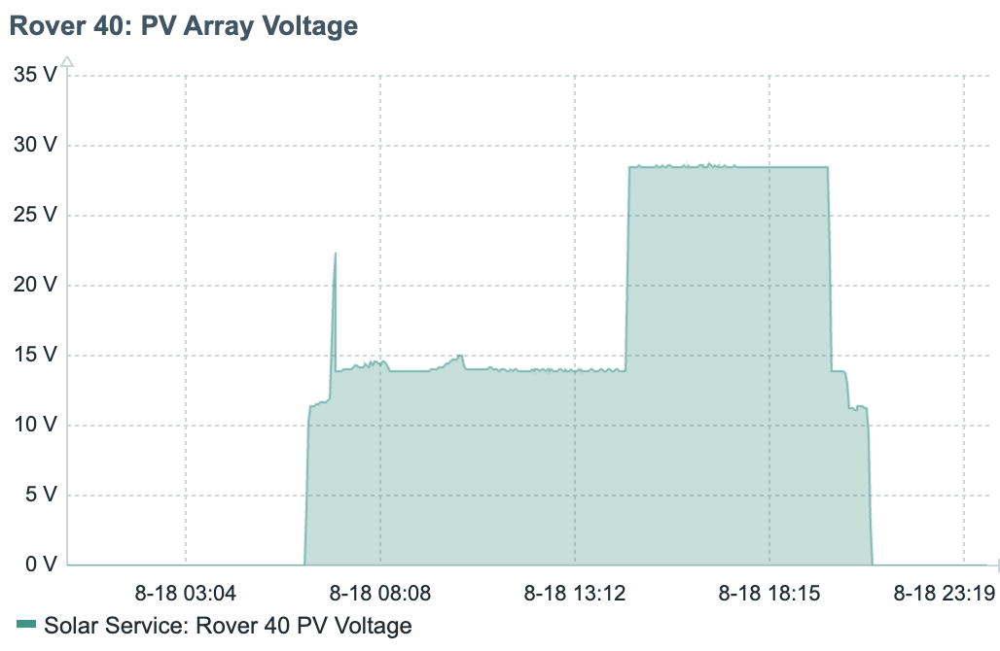
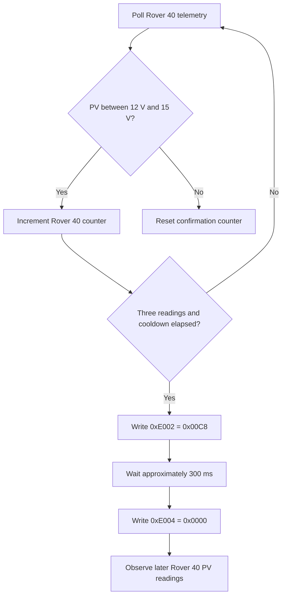

# Rover 40 MPPT Firmware Workaround

## Overview

Some Renogy Rover 40 controllers can enter a state where PV voltage remains near the 12v battery voltage instead of operating near the solar array's normal maximum-power-point voltage.

Observed behavior:

```text
Affected Rover 40 PV voltage: 14.0-14.1 V
Normal Rover 40 PV voltage:   approximately 32 V
```



In the graph above, we can clearly see the controller initializes and tries to lock at a higher tracking voltage, but then settles at 14v. The system continues charging, but the array operates inefficiently because the MPPT controller does not return to its normal tracking range.

> Observe the fixed behavior just after 13:12 in the graph!

After applying this fix, the controller initializes correctly in the morning and stays at a higher charge voltage all day until the sun goes down 😎

This project detects the low ~14v condition and replays a sequence that I found through many hours of testing - across several Rover 40 controllers. I found that we can reset the MPPT tracking loop by sending a carefully crafted sequence of events to the renogy BT-2 bluetooth module - the same sent by the official Renogy app when **User battery mode** is applied.


## Why This Workaround Exists

Testing showed:

1. Reapplying User battery mode in the Renogy app resets the Rover 40 charging state.
2. After the app applies User mode, Rover 40 PV voltage rises from approximately 14 V to approximately 32 V.
3. An Android Bluetooth HCI capture revealed that the Renogy app sends a specific two-write sequence.

The firmware in the [ESP dev board](./src/esp32-ble-probe.cpp) now reproduces that captured sequence instead of guessing at individual registers. You'll benefit from my hours of testing and start generating much more power from your existing solar panels.

## Affected Controller

The workaround is restricted to the configured Rover 40 controller. However, it may work for other buggy renogy controllers, though I've not spent the money to test those!

| Setting | Value |
|---|---|
| Controller key | `rover_40` |
| Observed BLE name | `BT-TH-E72E9AF5` |
| Primary MAC | `7c:72:e7:2e:9a:f5` |
| Alternate MAC | `80:6f:e7:2e:9a:f5` |

The Rover 60 is monitored normally but is not included in the recovery logic, since it's firmware is much more robust.

## Detection Logic

A Rover 40 sample is considered affected when PV voltage is stuck between 12 V and 15 V:

```cpp
const bool rover40PassThrough =
    controllerKey == "rover_40" &&
    pvVolts > 12.0f &&
    pvVolts < 15.0f;
```

The firmware requires three qualifying Rover 40 readings before taking action:

```cpp
static constexpr uint8_t MPPT_REAPPLY_CONFIRMATION_POLLS = 3;
```

This prevents a brief voltage transition from triggering the workaround.

Rover 60 polls do not increment or reset the Rover 40 counter. A normal Rover 40 reading resets the counter.

## Captured Renogy App Sequence

The Renogy app used Modbus function `0x06` over the Renogy BLE bridge.

### First Write

```text
FF 06 E0 02 00 C8 0B 82
```

Decoded:

| Field | Value |
|---|---|
| Renogy bridge address | `0xFF` |
| Modbus function | `0x06` — Write Single Register |
| Register | `0xE002` |
| Value | `0x00C8` — decimal 200 |
| CRC bytes | `0B 82` |

### Delay

The app waited approximately 300 milliseconds:

```cpp
static constexpr uint32_t USER_MODE_WRITE_GAP_MS = 300;
```

The firmware continues servicing OTA, Telnet, and Wi-Fi during this interval.

### Second Write

```text
FF 06 E0 04 00 00 EA 15
```

Decoded:

| Field | Value |
|---|---|
| Renogy bridge address | `0xFF` |
| Modbus function | `0x06` — Write Single Register |
| Register | `0xE004` |
| Value | `0x0000` — User battery mode observed in the capture |
| CRC bytes | `EA 15` |

The controller echoed both frames during the app capture.

## Recovery Flow



## Safeguards

### Feature Flag

The workaround can be disabled without removing the code:

```cpp
static constexpr bool ENABLE_BATTERY_TYPE_REAPPLY = false;
```

Set the value to `true` to enable automatic recovery.

### Confirmation Threshold

Three Rover 40 samples must match the affected voltage range before transmission.

### Cooldown

After both frames are transmitted successfully, the firmware waits 30 minutes before another attempt:

```cpp
static constexpr uint32_t MPPT_REAPPLY_COOLDOWN_MS = 1800000;
```

The cooldown is stored in RAM. A reboot or OTA update resets it.

### Controller Scope

Recovery runs only when:

```cpp
controllerKey == "rover_40"
```

The Rover 60 is never sent this sequence.

### BLE Write Mode

The captured app traffic used GATT **Write Without Response**, so the firmware uses:

```cpp
writeCharacteristic->writeValue(
    writeFrame,
    sizeof(writeFrame),
    false
);
```

The `false` argument selects Write Without Response.

## Expected Logs

When the condition is confirmed:

```text
[MPPT] Rover 40 stuck near battery voltage. Replaying captured Renogy User-mode sequence...
[MPPT] TX: FF 06 E0 02 00 C8 0B 82
[MPPT] TX: FF 06 E0 04 00 00 EA 15
[MPPT] Captured User-mode sequence transmitted. Watching Rover 40 PV voltage for recovery.
```

## How to Confirm Recovery

Successful BLE transmission does not by itself prove that MPPT recovered.

Confirm recovery using subsequent Rover 40 telemetry:

```text
Before recovery: PV voltage approximately 14 V
After recovery:  PV voltage rises toward approximately 32 V
```

Solar conditions affect the exact voltage. The important result is that PV voltage leaves the battery-voltage range and returns to the array's normal operating range.

## Failure Cases

### No Recovery Logs

Verify:

- `ENABLE_BATTERY_TYPE_REAPPLY` is `true`.
- The device is mapped to `rover_40`.
- PV voltage is greater than 12 V and less than 15 V.
- Three Rover 40 readings have occurred.
- The 30-minute cooldown is not active.

### Only the First Frame Is Logged

The first BLE transmission or the 300 ms sequence failed. Check the next error message and the BLE connection.

### Both Frames Are Logged but PV Remains Near 14 V

The sequence reached the BLE bridge, but recovery was not demonstrated. Check:

- The controller still reports User battery mode.
- The configured charging parameters remain correct.
- Solar conditions are sufficient for the array to operate above battery voltage.
- The BT-1 or BT-2 adapter remained connected through both writes.

### Recovery Repeats Too Often

The cooldown resets after an ESP32 reboot or OTA update. Confirm the ESP32 is not restarting unexpectedly.

## Important Limitations

- This is an observed workaround, not an official Renogy firmware fix.
- The sequence was captured from the Renogy app communicating with the tested Rover 40.
- A successful `writeValue()` call confirms transmission to the BLE stack, not the controller's final operating state.
- Recovery must be verified through later PV telemetry.
- Battery mode and charging parameters should be reviewed after initial testing.

## Related Documentation

See [`renogy_rover_modbus_values_library.md`](./renogy_rover_modbus_values_library.md) for:

- BLE service and characteristic UUIDs
- Modbus telemetry offsets
- Captured configuration registers
- Observed Rover 40 and Rover 60 values
- Frame decoding details

See the repository [`README.md`](./README.md) for installation, deployment, OTA, Telnet, API, Kubernetes, and monitoring instructions.
