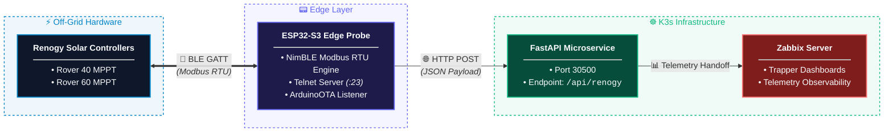

# 📊 Zabbix Observability

This is the Zabbix observability documentation for the **Modbus Solar Power Telemetry System**.

## 🌞 Project Overview

This repository focuses on the telemetry and observability aspects of the solar power system, specifically how data from Renogy solar equipment is ingested and visualized using Zabbix.


The telemetry pipeline includes:
- An ESP32-S3 microcontroller reading Modbus data via the Renogy Bluetooth stack.
- A Python RESTful API microservice (running on Kubernetes) processing the Modbus payload.
- Zabbix server ingesting telemetry data, providing real-time visualization and historical graphing.


## 🎯 Purpose

Zabbix provides infrastructure and service-level telemetry observability for the solar-microservice stack. It allows the system to report key solar power metrics and operational states to a Zabbix server, enabling operators to monitor and analyze system performance in real-time.

### Key Capabilities

- **Telemetry Ingestion**: Receives processed solar telemetry data from the FastAPI microservice
- **Real-time Visualization**: Custom dashboards for monitoring battery SOC, voltage, and charging current
- **Historical Graphing**: Persistent storage and trend analysis of solar power metrics
- **Alerting Hooks**: Triggers that can be consumed through Zabbix dashboards and monitoring rules

## 📡 System Architecture



## 📊 Telemetry Dashboard

The Zabbix dashboard (`morningstar_renogy_dashboard.json`) provides comprehensive visualization of the telemetry data. It includes graphs for various key metrics:

- **Battery Bank Voltage (V)**: Shows voltage levels from both solar systems and the microservice.
- **Battery Charging Current (A)**: Displays charging current from both systems.
- **Solar Array Voltage (V)**: Visualizes the solar array voltage levels.
- **PV Input Current (Amps)**: Displays PV input current from the microservice.
- **Battery State of Charge (%)**: Shows battery SOC from the microservice.
- **Solar Panel Array Potential Watts**: Plots the array's maximum power output.
- **System Temperatures (°C)**: Monitors ambient, battery, and heatsink temperatures.


## 🛠 Implementation Guide

To set up the Zabbix telemetry integration:

1.  **Zabbix Host Setup**:
    - Create a new host in Zabbix for the solar microservice.
    - Define the necessary items to collect telemetry data (e.g., battery voltage, charging current).

2.  **Zabbix Items Configuration**:
    - Create items to receive data from the microservice.
    - Use Zabbix trappers or similar mechanisms for data ingestion.

3.  **Dashboard Import**:
    - Import the `morningstar_renogy_dashboard.json` into your Zabbix server.
    - The dashboard will automatically configure the widgets to display data from the configured hosts/items.

## 🧪 Testing & Verification

To verify that telemetry is flowing correctly to Zabbix:

1.  **Check Data Flow**:
    - Ensure the microservice is successfully receiving and processing Modbus data.
    - Confirm that the `FastAPI` service is sending telemetry to Zabbix.

2.  **Verify Dashboard**:
    - After importing the dashboard, check that all graphs are populated with data.
    - Validate that the metrics align with actual system readings.

3.  **Check Logs**:
    - Review microservice logs for any errors related to Zabbix data transmission.

## ⚙️ Configuration

Zabbix integration requires specific configuration in the microservice:

```env
ZABBIX_ENABLED=true
ZABBIX_SERVER_HOST=zabbix
ZABBIX_SERVER_PORT=10051
ZABBIX_HOSTNAME=solar-microservice
```

Update these values to reflect the actual topology of your Zabbix server and microservice.

## 📋 Network and Service Matrix

| Service / Protocol | Source Node | Destination Node | Port / Channel | Purpose |
| :--- | :--- | :--- | :--- | :--- |
| BLE (GATT) | ESP32-S3 Probe | Renogy Controllers | 2.4 GHz Radio | Modbus RTU telemetry request/response |
| HTTP POST | ESP32-S3 Probe | K3s FastAPI | TCP 30500 | Ingestion payload transmission |
| Telnet | Workstation | ESP32-S3 Probe | TCP 23 | Remote console stream & monitoring |
| ArduinoOTA | Workstation | ESP32-S3 Probe | UDP/TCP Dynamic | Over-the-air firmware updates |

## 🛡 Safeguards & Resilience

- **Buffer Safety:** Uses a dedicated 128-byte static rxBuffer with bounds checking, overflow flags, and rigid 73-byte Modbus length verification to eliminate heap fragmentation and stack corruption.
- **Connection Timeout Hierarchy:** Enforces a 5,000 ms BLE connect timeout and a 3,000 ms notification collection timeout to prevent orphaned connections from locking the main execution loop.
- **Client Cleanup:** Disconnects and deletes NimBLEClient instances on every iteration to keep internal memory allocation clean over long-term operation.

## 🔧 Troubleshooting

If Zabbix reports are missing:

- Check that the service is running and that the Zabbix integration is enabled.
- Verify firewall and network connectivity between the service and the Zabbix server.
- Validate the host name and port configuration.
- Inspect application logs for Zabbix transport or authentication failures.

## 📚 Related Notes

Zabbix is part of the observability layer for this repository. It complements application logs, traces, and health endpoints by giving operators a centralized monitoring surface.

See or report issues [here](https://github.com/vinas1/solar-microservice/issues).