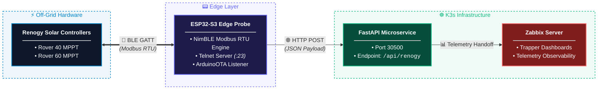

# 📊 Zabbix Observability

This is the Zabbix observability documentation for the **Modbus Solar Power Telemetry System**.

## 🌞 Project Overview


This repo contains an end-to-end telemetry pipeline for Renogy solar equipment over Bluetooth. An ESP32-S3 microcontroller reads Modbus data via the Renogy Bluetooth stack and pushes it to a Python RESTful API microservice running on a Kubernetes (k3s) cluster. The microservice processes the modbus payload where our custom provided Zabbix dashboards ingest the data for real-time visualization and historical graphing. Backend container images are packaged and deployed using GitHub Container Registry (GHCR).


## 🎯 Purpose

The Zabbix integration provides infrastructure and service-level observability for the solar-microservice stack. It allows the application to report health, availability, and operational state to a Zabbix server or proxy so operators can identify issues before they impact users.

### Key Capabilities

- **Telemetry Ingestion**: Receives processed solar telemetry data from the FastAPI microservice
- **Real-time Visualization**: Custom dashboards for monitoring battery SOC, voltage, and charging current
- **Historical Graphing**: Persistent storage and trend analysis of solar power metrics
- **Alerting Hooks**: Triggers that can be consumed through Zabbix dashboards and monitoring rules

## 📡 System Architecture



## 📊 Telemetry Observability

I'm using Zabbix for data ingest from the Solar-Service microservice, and have [provided a working graph](https://github.com/vinas1/solar-microservice/blob/main/src/zabbix/morningstar_renogy_dashboard.json).

You can easily use Prometheus with Grafana or just leverage telnet for real time telemetry.


### Alternative Monitoring Options

**Telnet Monitoring** - The ESP32-S3 edge probe includes a built-in Telnet server on port 23 that can serve as a real-time monitoring interface:

```bash
# Connect to the edge probe for live telemetry stream
telnet <probe_ip> 23
```

Telnet can also be piped into other monitoring functions or logging systems if Zabbix integration is not desired:

```bash
# Pipe telnet output to a logging service
telnet <probe_ip> 23 | tee /var/log/telemetry.log

# Pipe telnet output to another monitoring system
telnet <probe_ip> 23 | nc <destination_host> <destination_port>
```

## 🚀 Quick Start

1. **Hardware Requirements**
   - Any Renogy rover charge controller equipped with a BT-1 or BT-2 bluetooth adapter.
   - k3s or a way to run your docker microservice and a free zabbix instance
     - The bluetooth probe was built on the following device:
       - [ESP32-S3 DevKitC-1 N16R8 Development Board](https://www.amazon.com/dp/B0GVSHT2Q2)
     - Alternatively, use these specifications if the above is unavailable:
       - Dual-Core Xtensa LX7
       - 16MB Flash + 8MB PSRAM
       - WiFi & Bluetooth 5.0
       - USB-C
       - External Antenna Support for IoT & Embedded Projects

2. **Set Up the ESP32 Firmware**
   - Edit the [esp32-ble-probe.cpp](./src/esp32-ble-probe.cpp).
   - Upload it to your ESP32 device

## 📦 Dependencies

Before proceeding, ensure you have the following tools installed:
- Arduino IDE (for ESP32 development)
- Python (for the microservice)
- Docker (for containerization)
- kubectl (for Kubernetes operations)

## 🛠 Build and Deploy the Microservice

1. **Authenticate and Push Container Image to GitHub Container Registry (GHCR)**
   ```bash
   echo "<GHCR_TOKEN>" | docker login ghcr.io -u vinas1 --password-stdin
   docker build -t ghcr.io/vinas1/solar-service:v1 .
   docker push ghcr.io/vinas1/solar-service:v1
   ```

2. **Configure K3s to Use the GitHub Container Registry (GHCR) Secret**
   ```bash
   kubectl create secret docker-registry ghcr-secret \
     --docker-server=ghcr.io \
     --docker-username=vinas1 \
     --docker-password=<GHCR_TOKEN> \
     --docker-email=vinas1@nospam.com \
     --namespace=default
   ```

3. **Deploy the Kubernetes Manifest to Your K3s Cluster**
   ```bash
   kubectl apply -f solar-service.yaml
   ```

4. **Verify Pod Health and Test API Endpoint**
   ```bash
   kubectl get pods -l app=solar-service
   curl -X POST http://localhost:30500/api/renogy \
     -H "Content-Type: application/json" \
     -d '{"controller1": {"battery_voltage": 13.6}}'
   ```

5. **Inspect Logs and Manage Iterative Updates**
   ```bash
   # Monitor live container output
   kubectl logs -l app=solar-service --tail=20 -f

   # Force restart pods after pushing code updates
   kubectl rollout restart deployment solar-service

   # Reload Zabbix cache for updated trapper items
   zabbix_server -R config_cache_reload
   ```

## ⚙️ Configuration

The Zabbix integration should be configured through environment variables or deployment settings. A minimal configuration typically includes:

```env
ZABBIX_ENABLED=true
ZABBIX_SERVER_HOST=zabbix
ZABBIX_SERVER_PORT=10051
ZABBIX_HOSTNAME=solar-microservice
```

Update these values to reflect the actual topology of your environment.

## 📋 Network and Service Matrix

| Service / Protocol | Source Node | Destination Node | Port / Channel | Purpose |
| :--- | :--- | :--- | :--- | :--- |
| BLE (GATT) | ESP32-S3 Probe | Renogy Controllers | 2.4 GHz Radio | Modbus RTU telemetry request/response |
| HTTP POST | ESP32-S3 Probe | K3s FastAPI | TCP 30500 | Ingestion payload transmission |
| Telnet | Workstation | ESP32-S3 Probe | TCP 23 | Remote console stream & monitoring |
| ArduinoOTA | Workstation | ESP32-S3 Probe | UDP/TCP Dynamic | Over-the-air firmware updates |

## 🛡 Safeguards & Resilience

- **Buffer Safety:** Uses a dedicated 128-byte static rxBuffer with bounds checking, overflow flags, and rigid 73-byte Modbus length verification to eliminate heap fragmentation and stack corruption.
- **Connection Timeout Hierarchy:** Enforces a 5,000 ms BLE connect timeout and a 3,000 ms notification collection timeout to prevent orphaned connections from locking the main execution loop.
- **Client Cleanup:** Disconnects and deletes NimBLEClient instances on every iteration to keep internal memory allocation clean over long-term operation.

## 🔧 Troubleshooting

If Zabbix reports are missing:

- Check that the service is running and that the Zabbix integration is enabled.
- Verify firewall and network connectivity between the service and the Zabbix server.
- Validate the host name and port configuration.
- Inspect application logs for Zabbix transport or authentication failures.

## 📚 Related Notes

Zabbix is part of the observability layer for this repository. It complements application logs, traces, and health endpoints by giving operators a centralized monitoring surface.

See or report issues [here](https://github.com/vinas1/solar-microservice/issues).